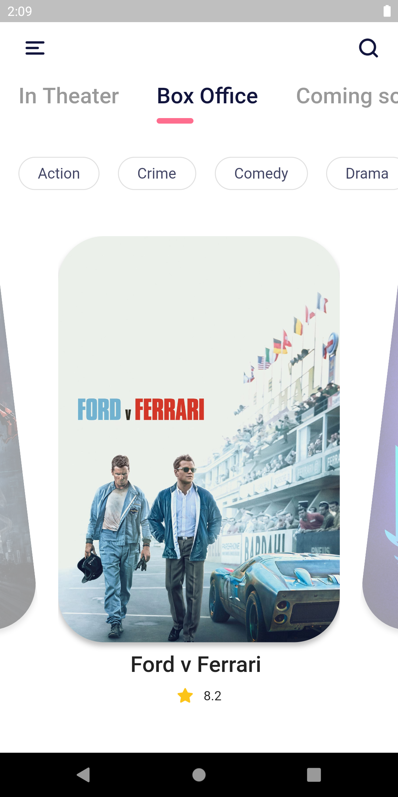
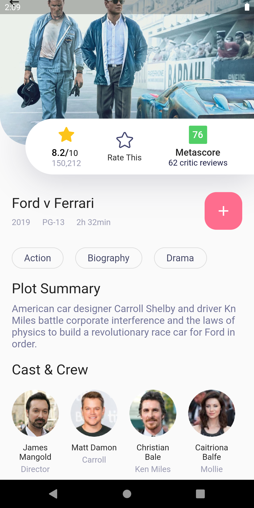

# CinemaRoll

A mobile app to view info on the latest movies.

  

## Getting Started

_You will require flutter and the Android SDK to follow along._

For the complete set up to start working with flutter visit here:
[https://flutter.dev/docs/get-started/install](https://flutter.dev/docs/get-started/install)

Choose your operating system and proceed accordingly.

**Step 1:**

Download or clone this repo by using the link below:

```

https://github.com/knightvertrag/CinemaRoll.git

```

**Step 2:**

Go to project root and execute the following command in console to get the required dependencies:

```

flutter pub get

```

**Step 3:**

Connect your physical device(with debugger options turned on) or emulator to your IDE.

**Step 4:**

Start the debug build by running the main.dart file

## CONTRIBUTING

1. Any new code you add should maintain the modular structure. Don't dump all the code in the main.dart file.

1. If you find any bugs, want to add any new features or expand upon the preexisting non-fuctional components, open an issue first and add the appropriate labels.
